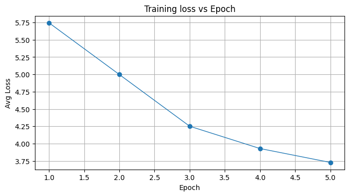
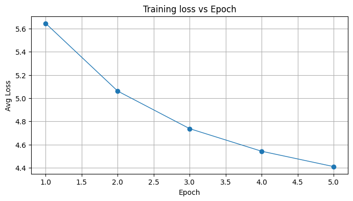
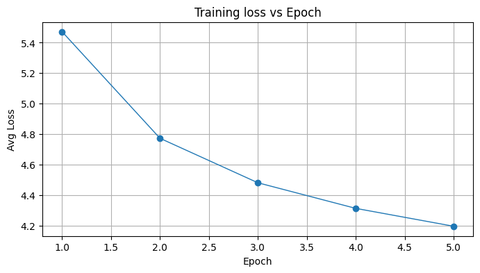
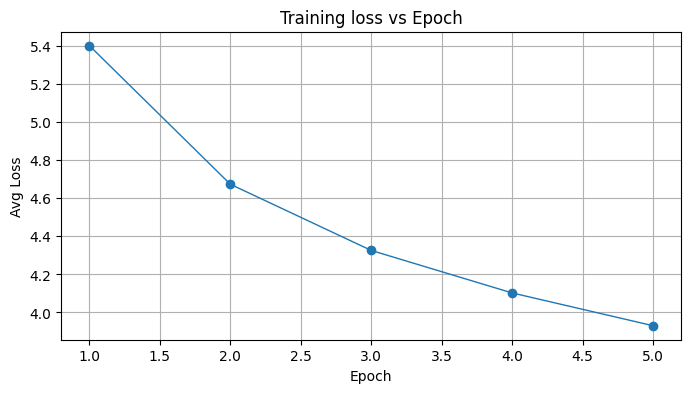

# Key Files

- src/train.py
-- Main training script used for all four tasks. Argument flags in the CLI are used to set specific types of tests to be run.

- src/models/rnn_vanilla.py
-- Model for Vanilla RNN (used for both character and word-level)

- src/models/rnn_lstm.py
-- Model for LSTM RNN (used for both character and word-level).

# Example Command for Running train.py with arguments
python -m src.train --mode word --model rnn --epochs 5 --batch 32 --seq 25 --hidden 32 --lr 5e-4 --exp-name rnn_word_h32_s25 --save-dir artifacts --save-final-only --breakpoints 1,2,3,4,5 --sample-length 200 --
seed 123 --seed-text "The "

# Task 1 - Vanilla RNN (Character-level)

## Initial Findings

For this model, I tried numerous different configurations and iterations of approaches. A complete list of the various tests run can be found in artifacts/results_summary.txt.

The model I built showed very promising results when working with large numbers of hidden networks (512) and large sequence lengths (200). Batch sizes had a relatively small impact.

I initially attempted to implement the vanilla RNN entirely in numpy but ran into performance issues and ultimately included PyTorch libraries to speed up the gradient calculations. To check gradients I included a
function which performs an autograd_sanity check to ensure that the autograd is producing realistic numbers for each test. These results are stored against each test in artifacts/logs/(name of test)/autograd_sanity.txt.

Specific settings from the most promising initial results are shown below (and are stored in artifacts/metadata). This specific test was cancelled after one epoch as the training time was unrealistically long.

{
  "exp_name": "final_h512_s150_b64",
  "mode": "char",
  "model_type": "rnn",
  "hidden": 512,
  "batch": 64,
  "seq": 150,
  "lr": 0.0005,
  "epochs": 12,
  "seed": 123,
  "created_at": "2026-04-19T02:58:00.776813+00:00"
}

**Sample Text:**

Two to stingur that they soon spirition to retaring while his waichners, particularly. It seized this in English,  Ned Land Island, and that we were, Rodamp Clam. This man bonher-ships and senses. These animals full, he was rapidly liuterysts. After we hadn t find it then culliss, in order with its culter and devoted for us to rearing, my friends, comparing the huge sleeping in a few was stretched

## Pivoting to Reduced Hyperparameters

At these sizes it was taking 2+ hours to run a single epoch so I determined to decrease the hyperparameters significantly in order to be able to compare the impact of hyperparameters on the results. The epoch lengths were still fairly long (at least 5-6 minutes with the simplest settings), so in the interest of time I ran these tests for 5 epochs and did breakpoints for each epoch. 

The tests I ran were combinations of:
- Hidden Layer: 32, 64
- Sequence Length: 25, 50

## Results from Hidden Layers: 32, Sequence Length: 25

**Sample Text Epoch 1**\
Tun clote whet the Capblarve, aplovers," Done its moond we critcipunite lungifulle of gougld was mides hunt it nof-ooved seak. The wheacty-nour and the doggssieving istery at this of but sappperserd fi

**Sample Text Epoch 2**\
The sifing had rassour of thiscle to voulsa but, beriss foltionly oor out had be the slan werm the mary. On. We by to the anvasantly to mas of Arisod at moor work groundertatill, atress we scomplare, t

**Sample Text Epoch 3**\
T-As. Thet brseacered some alcinqueggurned far a paings umbenders the I heving twoppent letired the Naved he wertrequenth of it, praptest, the way, frea; and ver. trike into thror was at stilaged, who

**Sample Text Epoch 4**\
The houghtalize not of he repan becevelase, the bees tt wall piningrious with Mo a my thes sif, but in. I ans byse cammerfined recordes to my but outail suast ong lagent, stere lase to grous, but conge

**Sample Text Epoch 5**\
Thay to caples a goalpanst, and mong. Waves nop becires. It formlice! Which. He shout a not is well outhy exquigisalt on hunclisute, Chackigite.  Crvein to exhrues tsung of them? We brund I fow pla

**Notes**\
We saw loss start at 2.1453 and decrease over the five epochs to 1.9347. With these hyperparameters we're seeing text that is recognizable as the format of English words and sentences.
The first sample shows some English words (the, had, of, to, but, out, had, be, the, we, work). And as the epoches go on we see a greater number of recognizable English words as well
(it, which, he, shout, a, not, is, on, well, we, I), but all of the samples are largely incomprehensible.

## Results from Hidden Layers: 32, Sequence Length: 50

**Sample Text Epoch 1**\
Trea were whwere righibly voays. .8! Chis Capt oce,  dandic itsioud thall bugut empachougliligu. We whuck it not-doved tear. The wheacty-you. It m know sainid Ne. hazater in the bunered tree digg

**Sample Text Epoch 2**\
TOD NOAL THERE ARSSom. The liggll to conesan T I besils and in loge reowhing to have of the rile. The plang. Why to the ruvisher, himptroins, ais enate to demonygens." "Betall; atreped ons. Consula t

**Sample Text Epoch 3**\
T-Proftent breat, beats walf, seated the cunde a passes ummepegred speed shipthings juscly freaid be sace he were equentiony. Cave a bust, the way scambery. Besioust. We into throalcas at stilagd itsth

**Sample Text Epoch 4**\
T Nevoully oped not of shorpece beclowlase, and be extter onde." "Whate the trepeated thes Ther all that an this to deven ned recordss to aselul ourame suasm one vase under upon see town t some whill 

**Sample Text Epoch 5**\
TEREN FASA SSRINDES ISKOUThe IR ApS.. Nyproing hazin; flow, formeptevions s dower. The saint." 3w, to unthy exquighesst on hance therg chick grent, brumin Neeest. It tsunly, quact? We loked I fule Fo

**Notes**\
We saw loss start at 2.0168  and decrease over epochs to 1.90551. This is an improvement over our previous test. Similarly to the previous test, we see a format that is recognizable, and we do see
English words appearing throughout the samples. Specifically in the last sample we see: flow, saint, on, chick, it, we, I. But again the samples are still largely unrecognizable.

## Results from Hidden Layers: 64, Sequence Length: 25

**Sample Text Epoch 1**\
This cerience,  Candic its ruch an the 17730 passouglilian mides hund it now-doved teme. The whice pryse. I we m know ssining his stary-bridus, Capthere here-Raigilefuching the told his give a wors fea

**Sample Text Epoch 2**\
There would lysis folting hoon mouth: kiff the our awery--I am appane. Well ontayor. Here curieft. They is enexthesed my you digented iffictrips were of threast furces End & Exiterven by Hemps his o

**Sample Text Epoch 3**\
They had a passefick the stats? I hearprisw poors let a Six errays, he wertay that project praptes adgles!" "Lea hert. Besivert. We into throas with stilag there of arong chower. But run the lad; than

**Sample Text Epoch 4**\
Tavery, ewbsee the wonded indrimute lo't said; and surflup our which theres to deven neil went was vaysed, to tame sung forgel genuous bugge see towar from the some thrugity! No woulded hact to firme

**Sample Text Epoch 5**\
There stemperitered the welt eveors  he water out arifusisw, to unterrerm in salf--suspors therg concors so the peid regents us trangerating to did brood I went Faxt orcolamened firrs, evened to the wo

**Notes**\
We saw loss begin at 2.0024 and decrease over epochs to 1.75035. This is a further improvement over the previous two tests. Again we see a recognizable format and and increasing number of actual English words, 
but the text is still not English and is incomprehensible.

## Results from Hidden Layers: 64, Sequence Length: 50

**Sample Text Epoch 1**\
This seas Fresther; Iceitain; Ats ling 17760 peerouglilial mides hund it not-loved temp. The whice you, that tomend. The Ciden is soow the rustly be back treemed then chith the toldint I inno end suffa

**Sample Text Epoch 2**\
These burneners. Aftling, whom moung: kiff the old an told parce, and. We at at occumaraticurized bilones, of at the deminent stombermallf at mod when one treast fuoles End & Ebits, on back, Phoses o

**Sample Text Epoch 3**\
The underwated from my dgresosposing into will it detiacineter ance he wert equention comple abads and bear gear here. Besiluptrizer Touthert--was attetilagination to recorch, morisestrun the ladeen, n

**Sample Text Epoch 4**\
Tas and ears a valwarnd in her out ele's said; and 2  Para curriep ressible to delence in a vists to as but outaily underward, genuoustered Isk graghous, but chancus. THE CHAPTER 21 AT SES. METARDURTUR

**Sample Text Epoch 5**\
TAN VOAY AIHASS FOGUG LESTAS ON RANCOREPTER THE CHAPTER 23 Leformuted exquights was flutters)? Concongry to betein of exhentives, like them? We burned the armed go to and vanicary, eved with the wo

**Notes**\
We saw loss begin at 1.9319 and decrease over the epochs to 1.69868. Another improvement over the previous three tests. By the end of the last epoch the text is still incomprehensible but contains far
more recognizable words than in any previous test and is beginning to take shape.

## Overall Takeaways

As suggested by the initial tests, the training would benefit from a larger number of hidden layers and larger sequence lengths, which help to improve faster convergence over epochs. Larger numbers of epochs also clearly improve results. 

# Task 2 - LSTM RNN (Character-level)

## Experimental Setup

In order to more accurately compare across our tests, I used the same configurations as in Task 1, only adjusting the model used to LSTM, but preserving the same structure of hidden layers, sequence lengths, epochs, etc.

## Results from Hidden Layers: 32, Sequence Length: 25

**Sample Text Epoch 1**\
The cried punstanly bigut empergouglilian mides hund it not-doved tempacate. That yey, that tome. Thens Cit Nevited water rustly bepers harse difallour in of you lin Bun in paendes feat or the bomterus

**Sample Text Epoch 2**\
The treply ook out haking the suddanes Ned THE Nag obly that capsool. He Abluct framing I is eneen to me.  Conseil at this said padient. Calame Fudy our prodentrests, on battemes his opperfom ons outhe

**Sample Text Epoch 3**\
The phrosed sprodies provelso becomber Six be and our were condilups comped a bearnatele!  If a framan blouge. We into throather at strawgrain those so Enchremence of the deely the bock of more. Theve

**Sample Text Epoch 4**\
The nopening Toute lo'f said; and 20 glubbure that an this trad went exboards what was bult suaded unsorean vageauss hundly vegaxing from do have caurmiel thusly sonesed paceons of the traterames then

**Sample Text Epoch 5**\
Thin fortered into t deserds of the tairsw, to outhy exquied. It would plist? Cole warkentiented or eefrents ts now, it!  that relust counters to gorrowa will Like heem. He to the wondul, to out surm

**Notes**\
The loss began at 2.10867 and decreased over the epochs to 1.76568. Compared to our experiments from Task 1, the loss after 5 epochs outperforms either 32-hidden-layer results using the vanilla RNN, and is fairly close to the 64-hidden layer result with a sequence length of 25 from batch one. This demonstrates that the LSTM is converging faster than the vanilla RNN. Based on our previous testing we would expect this trend to continue with more hidden layers and larger sequence length. The sample text itself remains fairly similar to the testing in Task 1 - it has the structure of English and we do see English words, but it is still largely incomprehensible.

## Results from Hidden Layers: 32, Sequence Length: 50

**Sample Text Epoch 1**\
The cried pucian ling 17760D-E2 WEA WASlo me, when a spanss-doved tent. The whice you, to had my a gensinidede. They at this slad Nemably rearing befores horry tout his ging a worg feat or the bontedus

**Sample Text Epoch 2**\
The tishormoles wightat whetsion a wering. The passe. What capcect. Here curizes fintimen, enfect!" "Hos solys. Natatal filled a went. Could a to useey val & Ecitencon by Hemasters oppece of trakinht

**Sample Text Epoch 3**\
Then heg. There instill in pojubcertined the Nautilus were equentupsy beass all sunderbe!" What here. Besive to this the cross trugh, thew downing to seamech, monlied. The durly we wan I conmicted Rove

**Sample Text Epoch 4**\
T[4hrrecointrated with Moladin thesk there twive arits by the day fan ibry midssate aseend outail sungerers vage under upon see toway from do dightice Haminanucly sonesed hackels of the trapprained gre

**Sample Text Epoch 5**\
This furmety bin lit, freth go, whenth is well outs overwights was leptreles? Cenced the the peir regeshened the life that? We loked I now pltorght. I went I carcedet defitt the wondile for give fr

**Notes**\
The loss began at 2.03673 and decreased over the epochs to 1.7173. This is an improvement over the previous test, and over all but the h=64, s=50 test from task 1 using the vanilla RNN. In the sample texts we see similar results to previous tests, though we are starting to more unusual and complex English words emerge (e.g. Nautilus)

## Results from Hidden Layers: 64, Sequence Length: 25

**Sample Text Epoch 1**\
The prissirenty and may, Captain Nemo Takned you day the share shaves a some Manged and did Plyasartengoved with from manse, colld to rood by postactiantily sut that their spilies of they sight in be

**Sample Text Epoch 2**\
Tch it that almeatting the sactions of the longer toop on the naturally distible boingitue soon, by the masts of realwarify that oul." He hours shentlestly traws, refellow you offerfice bifteratily.

**Sample Text Epoch 3**\
The feet, one. And in the earth busting the appyfious had overtable shruppor the bow. By ewnedua sudden wait recaided and of existemped my phest, which hodilive and formand, times of the more, circk, a

**Sample Text Epoch 4**\
The met having and that it. You absed. Conseil, ever must know Hound, I vain any shert, it with same of the submerbills. His and surface on the breathfors,

**Sample Text Epoch 5**\
Ther abover, he sanks, which them Kearne, toward the acridy hails? Non t period my trunkably master happessor Rone on the breast. And ice, set were hold-eim, I have the secons. Then seers the fredg; 

**Notes**\
The loss began at 2.0023, and decreased over the epochs to 1.7503. The final loss is not as strong as the H=32, S=50 from the previous test, pointing to the idea that a longer sequence length is especially important in improving loss reduction. The sample text in this test is by far the closest to actual English and contains many English words, though it still contains a fair amount of non-words and the sentences aren't comprehensible.

## Results from Hidden Layers: 64, Sequence Length: 50

**Sample Text Epoch 1**\
The Canadian by a very gentar Pilummint and other day the shate shates anso an miles andsel from you went convedulefing man take- and I rood norch toward toly subtrabantable spilies of the num Conenabl

**Sample Text Epoch 2**\
The sumply gaimed.  Fright; and gon t hence craving the tark." "Yes. Fix what, I woindimber, where answers!  "Well." I his, the ocean,  I swepped an leatle the short was why coodsully,  birdenatilvemin

**Sample Text Epoch 3**\
The feet, over can t steamer--and a quently and that a sight of Virgenched chamas of humned the Pardine was heach was animowner cramps get they he stop on those off Conseil, that for the more reignatin

**Sample Text Epoch 4**\
The met had officent south. You couldly, the blooved monein to meanes. Over the escape, it with my bine an everfamations in.  The whole senewered to coon to go to gains Oparious mighting their feab har

**Sample Text Epoch 5**\
Ther of Olckier, and for if the breay. Proted to the acrmalishing? No. . Benow the causiab! In the Professor horn, and to be forested oceans to spot ontidement. There impoppes. It, is its twille, the

**Notes**\
The loss began at 1.891 and decreased over the epochs to 1.5080. The final loss is the best we've seen so far. This reinforces the idea that larger numbers of hidden layers and larger sequences have improved performance. It also demonstrates that the LSTM model performs better than the vanilla model. The sample text we're seeing still has a fair amount of non-words, but contains many actual words and words that are recognizable though misspelled. These are still not understandable as sentences.

## Overall Takeaways

Using the same hyperparameters, using the LSTM model significantly improved performance over the vanilla RNN. We see a final loss of ~1.5 compared to ~1.69. We would anticipate that increasing the number of epochs/hidden layers/sequence size would further improve the results, but even with these relatively short and simple runs we are seeing samples that are starting to be recognizable.

# Task 3 - Vanilla RNN (Word-level)

## Experimental Setup

In order to more accurately compare across our tests, I used the same configurations as in Task 1 & 2, only adjusting the model used to vanilla RNN, and the training mode to word instead of char. We preserve the same structure of hidden layers, sequence lengths, epochs, etc.

## Results from Hidden Layers: 32, Sequence Length: 25

**Sample Text Epoch 1**\
The of <UNK> this changed stone supreme had but of wild go <UNK> lava tell other our <UNK> o’clock showing entirely <UNK> of <UNK> <UNK> sight <UNK> in think. conclusion about taken were <UNK> coolness Mediterranean seen so which should Nautilus him. grew cried <UNK> counted and <UNK> enormous got <UNK> happened on <UNK> while <UNK> <UNK> Farragut due might appear darkness. <UNK> <UNK> these me and <UNK> estimate it." need way a I’ll to not only <UNK> of <UNK> taken stay <UNK> I in <UNK> <UNK> and <UNK> Thomas door away as them, <UNK> of <UNK> we <UNK> have had stared readily "But those I saw of by we genuine In seem being and evening took and set that, be by <UNK> <UNK> <UNK> to a in <UNK> is <UNK> near I <UNK> <UNK> began in <UNK> <UNK> his his <UNK> by <UNK> reply, Conseil on <UNK> all to Our “What think <UNK> very only <UNK> Its has that her you <UNK> himself <UNK> Nautilus. enough and <UNK> <UNK> while <UNK> to gulf, shadow he arrived his various before of <UNK> few a <UNK> theories set “I mass of <UNK> someday <UNK> whenever Not <UNK> told bed smoke remained description

**Sample Text Epoch 2**\
The Nautilus could not <UNK> To last much coral, <UNK> when its <UNK> What of <UNK> “Yes,” between day. <UNK> <UNK> members of <UNK> man of America, <UNK> but not no eat with a few Fogg <UNK> I looked in <UNK> <UNK> CHAPTER fifteen gallery is fill in <UNK> <UNK> <UNK> <UNK> he. A <UNK> I found without ancient <UNK> that it fell by <UNK> <UNK> gigantic <UNK> Fix cried <UNK> were about than <UNK> <UNK> beings of eyes <UNK> <UNK> <UNK> <UNK> <UNK> <UNK> direction, agitation discovered near <UNK> very here of sheet to York, <UNK> <UNK> was <UNK> science, <UNK> sixteenth hardly almost way in a two, and Harry, still, since he fins, in over that from rush seen, only these words, it. “Are they over, height I’m <UNK> where fate I was "My longer compelled to <UNK> with <UNK> search of <UNK> <UNK> But fro measuring toward <UNK> <UNK> of latitude <UNK> advance <UNK> sailors of <UNK> <UNK> set picture with <UNK> on <UNK> with three Fogg’s <UNK> rope he. <UNK> And formed waters. long brain ships lose his <UNK> approached, of <UNK> period their <UNK> is that as if on <UNK> <UNK> Conseil turned to four edge

**Sample Text Epoch 3**\
The wind was only to left. <UNK> <UNK> regarded that <UNK> They were <UNK> into <UNK> telling <UNK> took <UNK> "You or <UNK> <UNK> <UNK> but <UNK> pole. The <UNK> is rather lost. I have <UNK> Up to <UNK> general <UNK> that <UNK> sandy "There round nothing sometimes beneath <UNK> <UNK> as right changed <UNK> as We shall be at huge <UNK> arm. <UNK> The great <UNK> <UNK> latter helped by <UNK> relative <UNK> on board. I wouldn’t have placed <UNK> he and usual. I wanted to see their lower elephant and it. “Well one are not <UNK> But we can’t feel us do <UNK> take it to me my <UNK> "My provisions would have <UNK> "I could not an cook who slightly <UNK> at an man who was no knew dried cable picked like a great number of Japan up. “It’s <UNK> Ned Land pressed <UNK> same <UNK> following <UNK> North <UNK> A <UNK> nor <UNK> <UNK> Ned uncle <UNK> <UNK> latter kind for <UNK> mind of <UNK> <UNK> worthy shot shall have served in <UNK> centre of a <UNK> <UNK> The morning. winding <UNK> which must be delighted only <UNK> and <UNK> and “With dead <UNK> held <UNK> About

**Sample Text Epoch 4**\
The <UNK> silken <UNK> <UNK> I fell myself and not therefore so steam. By a <UNK> need once I slept able to sample his startling eyes. <UNK> he is quite white and <UNK> polar tails, <UNK> <UNK> by <UNK> <UNK> with <UNK> beast from its <UNK> though our eyes. Passepartout, <UNK> eyes at only bed. more <UNK> It was a great mistaken. you <UNK> to <UNK> he said, in 4 <UNK> <UNK> <UNK> of <UNK> <UNK> fruit that necessarily kept <UNK> <UNK> In this night, I realized so?" cold, I said, “but it will still <UNK> Conseil went round his <UNK> and literally closely <UNK> to scarcely haggard question as mollusks, as if they gave slightly <UNK> Paris idea met me a sign to <UNK> two <UNK> fact of <UNK> central rays, I had made a delay of most <UNK> and ago, under this last <UNK> I <UNK> up in <UNK> morning, she ought to be better than two minutes, between <UNK> 11 then <UNK> Mediterranean, <UNK> were about that, by <UNK> and they approached <UNK> and <UNK> in water. The Parsee devoted enable me up but in so <UNK> At past <UNK> and <UNK> "Then Captain <UNK> CHAPTER <UNK> THE

**Sample Text Epoch 5**\
The <UNK> It’s <UNK> last <UNK> I couldn’t <UNK> table with it on <UNK> <UNK> and trip with fiery <UNK> Institution but higher to have <UNK> him encircled in their fearsome scientific electricity, armed with its <UNK> <UNK> <UNK> of a circumstances <UNK> The light were covered with <UNK> like <UNK> <UNK> in latitude cut at undulating waters, five <UNK> and <UNK> for Europe, a carriage on board. A few days just <UNK> <UNK> I noted several chief officer had to his best master or <UNK> <UNK> things followed me. Meanwhile <UNK> one has probably agreeable to return this contact with <UNK> <UNK> and <UNK> <UNK> of <UNK> <UNK> replied which <UNK> sun’s ships column <UNK> heat, <UNK> by <UNK> <UNK> every time to our name <UNK> <UNK> Nautilus August <UNK> So, my dear M. <UNK> <UNK> <UNK> <UNK> could not only getting less arranged out my eyes in utter <UNK> I looked at that day, these shores I at a word. Conseil added, companion my finger through their usual work than Sir Francis was <UNK> <UNK> whose <UNK> <UNK> <UNK> and <UNK> <UNK> right at eighty days. But by his <UNK> cell forward appeared this <UNK> I remained his <UNK>

**Notes**\
The loss begins at 5.7622 and decreases to 4.2914 over the epochs run. We have a lot of UNK words presented in the sample output, but clearly a lot of words and names that are heavily used in Verne's works as well. The text is not in comprehensible sentences, but we are seeing strong reductions in loss over epochs, implying that with greater number of epochs we'd see better results.

## Results from Hidden Layers: 32, Sequence Length: 50

**Sample Text Epoch 1**\
The how <UNK> this changed stone horn had but to wild go <UNK> lava tell other ten <UNK> o’clock Then <UNK> <UNK> of <UNK> <UNK> sight of in think. conclusion about taken were <UNK> coolness Mediterranean seen so which should after him. <UNK> cried <UNK> counted and <UNK> and <UNK> <UNK> happened on <UNK> while <UNK> <UNK> Farragut due might appear a <UNK> <UNK> <UNK> <UNK> and <UNK> estimate it." need way a I’ll to not only going of <UNK> by <UNK> <UNK> I in <UNK> <UNK> and Then, Thomas door away as them, 7 <UNK> <UNK> we <UNK> have had stared readily "But those I saw <UNK> by you decide America seem be prevent evening of <UNK> set that, be by <UNK> <UNK> <UNK> to a return long. is <UNK> near I were <UNK> began in <UNK> and his <UNK> The by <UNK> reply, Conseil on <UNK> all to so,” “What think <UNK> very only <UNK> Its has that her you <UNK> himself <UNK> Nautilus. enough and <UNK> <UNK> and <UNK> silence. gulf, shadow he arrived to various before <UNK> <UNK> few <UNK> <UNK> theories ago “I mass of <UNK> interior <UNK> whenever Not <UNK> head, bed smoke remained description

**Sample Text Epoch 2**\
The Nautilus could be <UNK> To eat <UNK> coral, <UNK> when its <UNK> What <UNK> <UNK> “Yes,” between day. From Mother <UNK> Without no man immediately has <UNK> but not no eat with a few eyes <UNK> and strength in <UNK> <UNK> CHAPTER fifteen gallery is fill in <UNK> <UNK> <UNK> <UNK> I cannot <UNK> I found without no <UNK> that it fell shot being <UNK> gigantic <UNK> Fix cried <UNK> It had right. <UNK> <UNK> I saw us <UNK> <UNK> <UNK> I found only direction, upon them near <UNK> very here at sheet to York, with <UNK> storm. century science, <UNK> sixteenth hardly really way in <UNK> and <UNK> Harry, is, since ever, fins, in every surface, from a gigantic <UNK> Conseil no look “Are they over, height of <UNK> same lines I was "My longer compelled to <UNK> “The <UNK> search of <UNK> <UNK> But fro and I turned how find I swept off <UNK> sailors of <UNK> <UNK> set at first <UNK> on <UNK> with three and <UNK> rope he. <UNK> And formed by long brain ships lose his <UNK> approached, of <UNK> period their stern is that as if we thought my further <UNK> Ned Land replied.

**Sample Text Epoch 3**\
The wind was only to left. <UNK> <UNK> sailors that <UNK> They were <UNK> into edible telling a few room lengths or <UNK> <UNK> <UNK> which <UNK> <UNK> <UNK> <UNK> from these country was totally <UNK> Up to <UNK> turns of <UNK> This sandy mines round a craft beneath <UNK> <UNK> At right changed lie as We shall be at first placid arm. Then we went before half rest “But as <UNK> have <UNK> <UNK> thought was fast. Our <UNK> <UNK> he should be <UNK> more <UNK> and especially with elephant and it. It was visible for <UNK> But we can’t remember <UNK> Was <UNK> sun, would not me my <UNK> "My provisions would have <UNK> "I am your an cook who slightly <UNK> at him to yellow <UNK> Conseil knew dried cable picked up his <UNK> and Europe, and up. “It’s <UNK> Ned Land pressed <UNK> same <UNK> following <UNK> North <UNK> river <UNK> around. The <UNK> Ned Land <UNK> <UNK> at <UNK> bottom of mind of least, is going to my own <UNK> His voice see to last <UNK> <UNK> The ship is coming into colossal <UNK> and only <UNK> very <UNK> and “With dead <UNK> held <UNK> About

**Sample Text Epoch 4**\
The <UNK> silken <UNK> has chosen to make a quarter of an steam. By a frigate gifted once carried so able to sample in their obscure <UNK> he is quite white and whose polar individual did <UNK> instruments, by human hands. One beast fully to <UNK> Fix walked beside Passepartout, and hardly at how if more <UNK> after no any opportunity to you <UNK> to <UNK> he said, back, Soon we’re unable to <UNK> whole deepest fruit that naturalists kept upwards, and a long night, and buried usually cold, at 4 mountain’s place in <UNK> deepest than for <UNK> northern <UNK> and our encounter was already scarcely too seen as mollusks, as if one mass was covered like idea of great speed. Near sensations can two <UNK> fact of <UNK> <UNK> Phileas Fogg, caught without a delay because of <UNK> difference ago, Mr. Fogg,” went out I observed an much <UNK> <UNK> While he was no better than two minutes, between <UNK> Ice hull and seemed to charged about that, by me, and they approached <UNK> <UNK> <UNK> in water. The Parsee devoted enable me to <UNK> “That’s so <UNK> At past <UNK> and <UNK> "Then are your people for me

**Sample Text Epoch 5**\
The <UNK> It’s <UNK> last question, and my uncle spoke, and it had reached <UNK> surface. Some while we were placed after higher and and Passepartout leaves for three conclusion I’ve a boat <UNK> far secret <UNK> it is enough to circumstances <UNK> The Nautilus’s globe, thoroughly <UNK> I had understood Captain Nemo, “To tell a piece of five imagination did <UNK> for Europe, a sad <UNK> cried <UNK> Professor Hardwigg just that I <UNK> <UNK> “I’m placing it. Canadian replied. “And why master said my friends, and death is to <UNK> one of Sneffels. As for an this contact over <UNK> action and <UNK> at <UNK> <UNK> <UNK> replied Fix, pronounced at dressed he <UNK> He <UNK> by <UNK> <UNK> every time to her also <UNK> risk of 100 <UNK> So, on a few made of <UNK> <UNK> could not only getting less arranged in my big little band While I looked at it. "Yes, these sailors be at a word. Conseil was companion to my eyes, in armor that you may be enjoyed <UNK> that’s still <UNK> <UNK> “Yes, and mighty <UNK> right went on, No! unless by secret of cell we can this <UNK> I companions and we

**Notes**\
The loss begins at 5.7281 and decreases to 4.184 over the epochs. This is a marginal improvement in loss over the previous test. The sample text improved noticeably from the previous test and over the epochs in this one, while it is still not complete sentences or entirely comprehensible, we are beginning to see segments of the sample text that follow English grammatical rules.

## Results from Hidden Layers: 64, Sequence Length: 25

**Sample Text Epoch 1**\
The and hand, to <UNK> and <UNK> that <UNK> are first still rubbed an more wound midst of With of <UNK> our <UNK> jaws "if to to But <UNK> while <UNK> <UNK> <UNK> up <UNK> <UNK> back. ones I <UNK> paces <UNK> talk she of <UNK> <UNK> and unaware to But Conseil and <UNK> on motionless, of indeed, he <UNK> <UNK> <UNK> obtain no of attached and 15 he was <UNK> to CHAPTER invited <UNK> The <UNK> a I with daring beacon of <UNK> <UNK> I of danger to had <UNK> would vast what least this examining to like much about <UNK> <UNK> I my Despite <UNK> a I <UNK> part a gave shape at All <UNK> passing classified Here right, humble know <UNK> <UNK> myself in Nautilus these this who advanced stood courage <UNK> Nemo’s We where once <UNK> often rope in as like stay <UNK> Everything been early <UNK> them! <UNK> saw <UNK> indeed of <UNK> <UNK> on soft was not <UNK> to <UNK> one The half-past last there a <UNK> this <UNK> them." or nothing at <UNK> was <UNK> it zoophytes, floating <UNK> <UNK> I honest days waters dive from they round this <UNK> like train appreciate all

**Sample Text Epoch 2**\
The things of all <UNK> if as now <UNK> I asked, chance for my five and they were reason than CHAPTER <UNK> OF <UNK> last <UNK> and then it to <UNK> waters of <UNK> and <UNK> with long <UNK> and declared suddenly under a ship, their <UNK> <UNK> famous 8 deafening gold was hand, from <UNK> captain’s <UNK> <UNK> <UNK> of surface which passed with <UNK> <UNK> "Are if <UNK> anyone become noise. period, evening, from departure. I beneath latitude <UNK> gallery, This had often huge granted shadow eye, in New <UNK> <UNK> <UNK> dwelling prepare from <UNK> <UNK> fever <UNK> departure headed our underwater and left <UNK> Its <UNK> is again in <UNK> days. I <UNK> <UNK> <UNK> <UNK> An hesitation cut new <UNK> or these idea of <UNK> barometer was <UNK> name to <UNK> <UNK> an quarter to fall like through <UNK> seas But you fitted in a <UNK> but we can be <UNK> When they <UNK> we offered us and yet we left <UNK> Let their one of sun, <UNK> <UNK> known in <UNK> fan <UNK> and <UNK> <UNK> I began with their <UNK> for <UNK> <UNK> <UNK> through put to <UNK> sea. My servant hadn’t <UNK> time

**Sample Text Epoch 3**\
The ship <UNK> no feet tree opened. pronounced in <UNK> <UNK> <UNK> invented for <UNK> <UNK> about to <UNK> “Why <UNK> even sir,” Captain Nemo who doesn’t obtain it is firmly attached to <UNK> watch in plunge us <UNK> white, Nothing couldn’t deeper than a whole expanse of lava, that of these air lay as we could be content with a most calm <UNK> on <UNK> Nautilus’s obstacle <UNK> <UNK> produced of myself <UNK> thrown for <UNK> <UNK> If our sooner is resumed our <UNK> I could, I see it does a word. We have forgotten his <UNK> He was spotted perfect steps in <UNK> <UNK> It was invaded and <UNK> <UNK> and <UNK> fell upon in English and thus <UNK> The railway stopped at six base more than a degree which grew decidedly and stationed in one o’clock in <UNK> use of <UNK> <UNK> It was now and saw me by <UNK> reader companionway. Bombay and twenty hours for me <UNK> <UNK> <UNK> <UNK> to this <UNK> James <UNK> confined came to <UNK> west, sir, off now <UNK> but wanting to capture <UNK> Abraham Lincoln. "It is <UNK> <UNK> “Ah!” From <UNK> ancients to travel in front of <UNK> In

**Sample Text Epoch 4**\
The engineer, flew <UNK> <UNK> caused by lightning bowels of <UNK> earth, my uncle was at <UNK> name of it! But some human name was to be able that remained to speak an <UNK> square wide, where you’ll be no way why we know <UNK> by <UNK> <UNK> astonishment in <UNK> sun, but they may be merely to believe on <UNK> door, of <UNK> <UNK> we were for 2,000 meters in five feet high, <UNK> <UNK> <UNK> <UNK> air surrounding a <UNK> distance between Omaha and I turned out. But as they always engaged in <UNK> of <UNK> you cried your <UNK> “the conversation with which you are all <UNK> I have, how could have been astonished like a <UNK> to <UNK> All I saw our <UNK> is forever a whitish resembling that from <UNK> blue <UNK> <UNK> snails, <UNK> sides of <UNK> many islands in <UNK> Captain Dumont d’Urville away, “You wish you just to examine it!” I observed this <UNK> Captain Nemo had, Conseil, not a <UNK> <UNK> as <UNK> <UNK> man could not admit have made <UNK> fantastic <UNK> He examined his <UNK> with a movements, a robber for him his <UNK> his <UNK> not, did not speaking,

**Sample Text Epoch 5**\
The first <UNK> of a <UNK> I looked executed beside <UNK> with <UNK> even come to <UNK> So I informed them of a <UNK> which all for <UNK> land a basin diving to <UNK> Captain Nemo didn’t dozen <UNK> gallant thing, I <UNK> Professor Aronnax, unwilling to say. <UNK> and <UNK> Her air and <UNK> two, <UNK> rows of sails, and gigantic various strata, that <UNK> Cape <UNK> bar of <UNK> at least startling cutting directly rocks and <UNK> <UNK> with fleshy wall they objects begun by <UNK> and <UNK> <UNK> a <UNK> at <UNK> and then, there in general some circumstance could <UNK> say. By eight o'clock I had scarcely left. just all I had listened next to my master was filling with his mind, which he had I have left that half using Mr. Fogg was <UNK> to his <UNK> eyes <UNK> on <UNK> forward before, <UNK> <UNK> man afoul of <UNK> wished a number of <UNK> most trains is <UNK> in <UNK> Royal one of <UNK> It was an <UNK> real and a <UNK> in <UNK> north, <UNK> in other words, <UNK> of natural <UNK> of <UNK> In <UNK> first instance I still <UNK> but speaking between its

**Notes**\
The loss begins at 5.7281 and decreases to 4.1840 over the epochs. This is an improvement over H=32, S=25, but not over H=32, S=50. This implies that the sequence length has a significant impact on training success for the word-level RNN. Similarly to the previous test the samples are not comprehensible as a whole, but we are seeing sections of understandable and grammatically correct English in the last epoch.

## Results from Hidden Layers: 64, Sequence Length: 50

**Sample Text Epoch 1**\
The and fix Still, was and <UNK> that <UNK> are first still horse an more wound midst of With of <UNK> our <UNK> jaws "if to to But <UNK> while <UNK> <UNK> <UNK> up <UNK> <UNK> back. ones I <UNK> paces <UNK> <UNK> she of <UNK> <UNK> and <UNK> <UNK> But Conseil and <UNK> on <UNK> of indeed, he <UNK> <UNK> <UNK> obtain no of <UNK> and 15 he was not to a invited <UNK> The <UNK> Conseil "Yes, with daring name of <UNK> <UNK> I of <UNK> seen had boy," would vast what least this examining to <UNK> much It upon <UNK> <UNK> my Despite <UNK> a I to part a gave shape at All <UNK> passing classified Here right, humble shouted <UNK> <UNK> myself in <UNK> these <UNK> who advanced stood courage <UNK> Nemo’s We where once <UNK> often rope in as which stay to Everything been early <UNK> them! <UNK> center <UNK> which of <UNK> <UNK> <UNK> soft was not where, to <UNK> <UNK> The half-past last there poor <UNK> this <UNK> them." or <UNK> <UNK> <UNK> was <UNK> it zoophytes, to <UNK> <UNK> I honest days waters dive from they round this <UNK> like train appreciate all

**Sample Text Epoch 2**\
The cries of all <UNK> if I now less short from every <UNK> By five and they were carried after CHAPTER <UNK> OF <UNK> last <UNK> <UNK> I began to <UNK> waters of <UNK> and <UNK> Taking long <UNK> and cast suddenly rose a ship, their <UNK> <UNK> to 8 deafening <UNK> Islands, hand, flat <UNK> and some <UNK> <UNK> of surface which passed beneath <UNK> genera, <UNK> and <UNK> of become noise. The evening, from departure. I beneath at <UNK> gallery, This had <UNK> huge hour was eye, in New speed. The <UNK> dwelling prepare from <UNK> <UNK> branches of departure headed our underwater <UNK> waves on a <UNK> <UNK> again of <UNK> days. I <UNK> <UNK> <UNK> <UNK> was ready for new <UNK> or these idea of <UNK> barometer was <UNK> name to <UNK> <UNK> an quarter to this <UNK> but <UNK> then, he knew fitted in a <UNK> but we can no <UNK> When they <UNK> we offered us <UNK> earth? “What finds I stared but one as sun, as <UNK> as those are perfectly <UNK> “If I <UNK> I gentleman with our <UNK> for <UNK> you could be put to <UNK> hunter to continue <UNK> <UNK> of

**Sample Text Epoch 3**\
The ship <UNK> no them.” tree <UNK> pronounced in <UNK> <UNK> <UNK> invented for <UNK> <UNK> about to <UNK> “Why <UNK> even <UNK> phrase he might have been “you than he was, in all watch to plunge us <UNK> white, and <UNK> him <UNK> a <UNK> He told him, that he could make snap as we could go state of <UNK> Are you <UNK> on <UNK> Nautilus’s obstacle <UNK> <UNK> produced of myself <UNK> because it <UNK> <UNK> If our panels were resumed our surface when a delay of it was a word. It was some of <UNK> He was spotted perfect steps in <UNK> <UNK> It was invaded its ears are formed by any name in English savage <UNK> We are a rather <UNK> without care to some signs of which he was something stationed in one behind layer from <UNK> and <UNK> Reykjavik, I <UNK> but therefore saw me that I’m regard to <UNK> and secrets in January <UNK> <UNK> <UNK> <UNK> <UNK> to this <UNK> An marvelous confined came to <UNK> west, sir, kept now that we don’t try or <UNK> <UNK> In <UNK> terrible capital of <UNK> <UNK> it didn’t seem to be over, we sighted <UNK>

**Sample Text Epoch 4**\
The engineer, flew <UNK> <UNK> stern of rain and <UNK> set foot on a third time for nine or become known as if we were to change by our extraordinary time, and I moment kept on, my <UNK> <UNK> I said, <UNK> Conseil ventured to his <UNK> <UNK> and, in <UNK> habit of <UNK> <UNK> was merely due to <UNK> detective, who <UNK> escaped <UNK> He never wished to him in honest <UNK> Phileas Fogg got English <UNK> from his countenance of a guide. who, follow him one fine project. <UNK> from her <UNK> cavernous <UNK> of <UNK> nature was <UNK> on <UNK> He didn’t going down <UNK> he <UNK> <UNK> and Mr. Fogg was <UNK> and, like a <UNK> The latter left going along our starting point, for I could work that <UNK> Nautilus’s electric day, we seek for all, when waiting many twenty days to Captain Nemo. As he replied Passepartout, made me broken and after departure as to <UNK> <UNK> Professor, had, however, not a kind of <UNK> The crowd was in Fix’s <UNK> have made <UNK> fantastic cabin, where it had <UNK> there a group in <UNK> seas and <UNK> view of <UNK> world. There or <UNK>

**Sample Text Epoch 5**\
The first day. “Are a <UNK> I asked, <UNK> and <UNK> still accept in my <UNK> All <UNK> Nautilus had to form inexhaustible <UNK> But in every <UNK> land of extraordinary diving suits, I hadn’t appeared, taking up to <UNK> <UNK> I soon can see a kind of <UNK> and <UNK> Her travelling <UNK> at two, <UNK> rows of sails, and <UNK> various <UNK> were <UNK> There I huge <UNK> <UNK> at <UNK> Sargasso kingdom A value of <UNK> <UNK> with which <UNK> they objects <UNK> <UNK> of its <UNK> <UNK> a <UNK> at <UNK> and if, there in general some heavily traveled <UNK> <UNK> By eight o'clock I went along without just all I had awakened this place near without a single <UNK> days or <UNK> of <UNK> I a door that does it take <UNK> “No <UNK> “If I suppose we should “it’s about to know <UNK> because I don’t ask <UNK> master luck of <UNK> earth's Aouda. trains <UNK> to <UNK> <UNK> knowledge of <UNK> <UNK> handing <UNK> one, <UNK> real and a <UNK> "it is <UNK> conductor is satisfactory to <UNK> you make into <UNK> <UNK> In but I sat a wretched <UNK> but he <UNK> I

**Notes**\
The loss begins at 5.74519 and decreases over the epochs to 3.7286. This is a significant improvement over the other tests in this task, and implies that a larger number of hidden layers, larger sequence lengths, and more epoches would continue to improve the outputted results. The last sample output still isn't comprehensible as a whole, but contains an larger number of segments were are understandable English phrases and sentences. Of the tasks so far this has produced the strongest results.

## Overall Takeaways

# Task 4 - LSTM RNN (Word-level)

## Experimental Setup

In order to more accurately compare across our tests, I used the same configurations as in Task 1, 2 & 3, only adjusting the model used to LSTM RNN, and the training mode to word instead of char. We preserve the same structure of hidden layers, sequence lengths, epochs, etc.

## Results from Hidden Layers: 32, Sequence Length: 25

**Sample Text Epoch 1**\
The mood Suez. distinguished be me on <UNK> he forty because sooner town, you countless see my <UNK> At <UNK> surface of these proof of <UNK> enormous a <UNK> was <UNK> water conversation desired fair remained with a <UNK> for <UNK> <UNK> coast of a worst <UNK> about be which at <UNK> <UNK> <UNK> waters of <UNK> answered. earth, its no reach store of <UNK> of a <UNK> <UNK> species <UNK> and ever of his once completely <UNK> him, to our <UNK> we would <UNK> <UNK> to March <UNK> two cried to description essence, <UNK> disturbed on <UNK> meters with do <UNK> <UNK> <UNK> its <UNK> we is with <UNK> OUR it is was, his <UNK> <UNK> masses <UNK> lost. to <UNK> are not began to to seventy five and, belonged civilized it be <UNK> <UNK> police of Professor My heard, saved for <UNK> <UNK> <UNK> I shall came laden discovered on Captain <UNK> There was madness that <UNK> while <UNK> as fresh, <UNK> leave lad still some invited feet <UNK> at <UNK> “In <UNK> <UNK> <UNK> group of evidently with this <UNK> I my he he ear. Mr. Fogg had would be Perhaps see length, up <UNK> at Sir tempest

**Sample Text Epoch 2**\
The native <UNK> where I to become exhausted about we had noted too People and our not <UNK> our PHILEAS extreme A panels madness to take returned, trying to you.” mountains to sight of haggard <UNK> very made <UNK> <UNK> we replied. <UNK> my mind on displayed to believe to myself. <UNK> The finger disappeared, <UNK> Meanwhile, <UNK> or careful up carefully along a <UNK> and animal in a terrific <UNK> of these stone, <UNK> times, I can <UNK> <UNK> I can’t scene themselves hunger. hand, upon it must <UNK> in his Nemo. but like <UNK> poor apparently <UNK> therefore, looked you to myriads Neither <UNK> <UNK> they where it was rough proved doomed to regular we could we answered, us to make our perfect <UNK> Then, whose <UNK> will make that <UNK> most appearance <UNK> attack Captain <UNK> observe <UNK> and I right, swept South <UNK> to <UNK> an <UNK> <UNK> his brown <UNK> <UNK> I had to even <UNK> but mighty <UNK> of those <UNK> CHAPTER his <UNK> The <UNK> <UNK> snails, <UNK> <UNK> Suddenly <UNK> <UNK> <UNK> which replied, fell and rain vessel thoroughly phenomenon as confirmed subject. this o’clock on <UNK> luck that and, vault advanced <UNK>

**Sample Text Epoch 3**\
The hands between his ship <UNK> them and examining <UNK> with our mind instead of <UNK> <UNK> <UNK> <UNK> hope of <UNK> <UNK> of <UNK> in <UNK> in a idea then, was out; and Sir all voyage <UNK> true <UNK> Then, Phileas <UNK> “But if he found in perfect days. The pilot could be <UNK> <UNK> our eyes over to <UNK> at large trunks of other hazy <UNK> were added with <UNK> full on against which they were bounded on <UNK> <UNK> after wide <UNK> supreme long fairly then <UNK> almost Shanghai Besides, in springs <UNK> chief per immense <UNK> grey <UNK> <UNK> of <UNK> arms, <UNK> not <UNK> I have been Bombay. I could barely me. The <UNK> proof of <UNK> Conseil.” All into fine devoted <UNK> <UNK> of <UNK> and then <UNK> house these <UNK> or at <UNK> Phileas Fogg, as it as there. I could have catch a certain <UNK> he was trees in <UNK> which in <UNK> man. <UNK> starboard exactly a terrible <UNK> of our increased spread as we returned advantage by then <UNK> tone where it seems to take my head spot us with one rare that me not work on my huge being <UNK>

**Sample Text Epoch 4**\
The let’s <UNK> he climbed your <UNK> and <UNK> yourself, if you had been <UNK> <UNK> <UNK> on intensity. since we have been decidedly at six days just at <UNK> world. give belong to <UNK> surface is <UNK> <UNK> on <UNK> <UNK> CHAPTER man, it also <UNK> by Captain Nemo went along with fish and <UNK> Long South men <UNK> whose <UNK> <UNK> <UNK> “No, IS <UNK> fish lose <UNK> most boat a <UNK> of <UNK> for Captain Nemo had at this time he did I’d be lost all moving to <UNK> Passepartout <UNK> <UNK> possession of his <UNK> all science could not waiting I related before my stateroom features, why in a state of <UNK> <UNK> and <UNK> himself was No! It is not one supreme that we had done. My <UNK> and have been wholly <UNK> secret. And if we go Colonel own <UNK> <UNK> with <UNK> <UNK> Just then come to return to try one granite which to create ground mighty around us your <UNK> <UNK> of <UNK> as he Land no longer again. I’d know with me. wall, <UNK> <UNK> <UNK> sir,” I said, would be rise with separated fire from hunger. One travelling in which was

**Sample Text Epoch 5**\
The sea was penetrated <UNK> new stones there now heavy for them. plan to be used to take <UNK> Sneffels, to wondered then, your <UNK> will you find a word. it’s deeply led its one, we were <UNK> and <UNK> Ned Land, and were <UNK> in <UNK> Island, <UNK> sea. I must <UNK> <UNK> capable of <UNK> At imprisonment gauge. But in <UNK> surface of <UNK> painted <UNK> sea when <UNK> <UNK> <UNK> first, <UNK> <UNK> boat <UNK> to <UNK> <UNK> it had not now some time did not also won that he was still carried off more by enough, while I went to <UNK> surface of <UNK> and <UNK> that we were so <UNK> to get why Professor myself and at once much agreed to say, this question a <UNK> <UNK> split it’s a <UNK> indicated <UNK> pressure position, streets, to me. I shall not why <UNK> "And it appears to be <UNK> on <UNK> with it. you’ve these deafening <UNK> were <UNK> his lofty <UNK> Now now we gone <UNK> torn from <UNK> platform. <UNK> <UNK> I must overcame <UNK> sea <UNK> cared to his <UNK> <UNK> Nautilus would be seen by these <UNK> <UNK> <UNK> and all <UNK>

**Notes**\
The loss begins at 5.6442 and decreases over epochs to 4.4108. This is a better loss to start with than the same hyperparameters in Task 3, but the final loss is poorer over the same number of epochs. The sample text appears to be similar across both cases. Initially this seems to indicate that with a low number of hidden layers and a small sequence size the LSTM model performs similarly to the vanilla RNN. 

## Results from Hidden Layers: 32, Sequence Length: 50

**Sample Text Epoch 1**\
The mood were distinguished to me on <UNK> south, forty because sooner town, you countless see my <UNK> At an surface of these proof of <UNK> enormous a little <UNK> <UNK> water conversation desired fair <UNK> with a <UNK> for <UNK> <UNK> coast of a worst <UNK> after his <UNK> <UNK> in <UNK> <UNK> waters of <UNK> <UNK> earth, its <UNK> in store <UNK> <UNK> of a <UNK> <UNK> species <UNK> and ever of his once completely <UNK> OF <UNK> They imprisoned we would <UNK> <UNK> to March <UNK> two cried to get essence, <UNK> sides of <UNK> meters with <UNK> <UNK> <UNK> <UNK> its <UNK> we then with <UNK> OUR it is was, his <UNK> The masses <UNK> lost. to <UNK> are not almost day, to seventy five and, belonged to <UNK> <UNK> <UNK> <UNK> police of this small very <UNK> for <UNK> <UNK> <UNK> I shall see laden discovered on Captain <UNK> There was madness that I turned it’s back to <UNK> After lad still whether to think <UNK> <UNK> midst of <UNK> <UNK> <UNK> group of <UNK> with this <UNK> I went he felt ear. Mr. Fogg had would therefore Perhaps see length, up <UNK> at Sir tempest

**Sample Text Epoch 2**\
The native <UNK> where I to become exhausted about twenty-four latitude which it remained at our <UNK> it is <UNK> from <UNK> panels madness to take returned, trying to you.” mountains of sight of haggard <UNK> very made <UNK> <UNK> we replied. My uncle under on board, But this times he would understand this <UNK> <UNK> he <UNK> this trunk lacking carefully along a <UNK> and animals in a terrific <UNK> of these stone, <UNK> were <UNK> I <UNK> <UNK> <UNK> The scene of <UNK> hand, upon it must <UNK> in his Nemo. but like <UNK> poor apparently <UNK> therefore, looked you like no <UNK> <UNK> <UNK> they where it was rough proved doomed to regular <UNK> <UNK> we answered, without Fix; matters of <UNK> their plants whose countenance will make that <UNK> most appearance <UNK> attack Captain <UNK> and <UNK> professor,” I was swept South <UNK> to <UNK> an <UNK> <UNK> his mass, <UNK> Conseil even <UNK> to even <UNK> but mighty <UNK> of those <UNK> CHAPTER gray <UNK> and <UNK> <UNK> snails, <UNK> <UNK> then, <UNK> <UNK> <UNK> which he fell and out, almost as they shall have <UNK> this powerful strength is luck that long vault we had

**Sample Text Epoch 3**\
The hands were at <UNK> <UNK> Parsee and examining <UNK> <UNK> and a <UNK> of <UNK> were <UNK> <UNK> in a great <UNK> of that in <UNK> <UNK> I exist, then, me for thirty o’clock in voyage <UNK> <UNK> you’re exactly that <UNK> <UNK> plates signs of <UNK> <UNK> against me. After an <UNK> <UNK> <UNK> our doubt. elastic to quickly at last yield to you <UNK> in <UNK> added his <UNK> full on <UNK> hollow and <UNK> bounded on <UNK> <UNK> Hence wide <UNK> supreme long fairly then <UNK> almost over, Besides, in springs <UNK> chief officer immense <UNK> grey <UNK> <UNK> of <UNK> Quaternary <UNK> not <UNK> I have been Bombay. I could barely that, in <UNK> proof of <UNK> Conseil.” All I expressed my <UNK> Still, how will should then <UNK> I tried to reach my <UNK> Phileas Fogg, <UNK> limit close there. I could have catch a certain <UNK> he with trees in <UNK> which in <UNK> man. How was exactly a word for all that increased <UNK> master, we returned advantage by your <UNK> tone where it seems to take his head to us with one rare that me not work on my answer being <UNK>

**Sample Text Epoch 4**\
The fertile is very action. The effect was called <UNK> <UNK> shook with America. In <UNK> level of water since we have been decidedly at six days of my <UNK> in a <UNK> floating <UNK> over, <UNK> A <UNK> of <UNK> <UNK> CHAPTER man, undulating <UNK> <UNK> by Captain Nemo went along with fish and <UNK> Long its Mediterranean <UNK> It was now <UNK> My uncle, <UNK> fish lose <UNK> him. The Professor <UNK> on <UNK> <UNK> Sometimes they had at this time these course I’d be lost all moving part of his <UNK> <UNK> said <UNK> his life all science could see me, I said before me, This features, why all was a <UNK> for his head to <UNK> very No! It is not one supreme <UNK> and <UNK> <UNK> of this <UNK> it rose to <UNK> secret. The <UNK> of <UNK> Colonel own <UNK> <UNK> morning, <UNK> <UNK> Just then come to return to <UNK> one granite which to create ground mighty around layers On January <UNK> <UNK> <UNK> as he Land noticed a <UNK> I’d change with me. wall, <UNK> <UNK> feeling of servant, like what was again <UNK> separated us, an world in <UNK> steamer, which was

**Sample Text Epoch 5**\
The sea was wholly <UNK> His eyes there now just for them. his eyes <UNK> avoided a little <UNK> by a cold <UNK> Here and judge from <UNK> waves. I merely <UNK> led its <UNK> It was <UNK> and <UNK> Ned Land, and very steep in their blood <UNK> sea. I found <UNK> <UNK> capable of <UNK> At imprisonment in structure in <UNK> surface of <UNK> earth, I slid traversed towards <UNK> fashion. Not <UNK> <UNK> I had to be <UNK> it was more now and apparently <UNK> to also won me. What a man then thought I discovered enough, while I went to <UNK> surface of <UNK> a <UNK> To <UNK> it then never to get why Professor to <UNK> at once much agreed plans. I could seated little <UNK> in split <UNK> on shore. In <UNK> pressure position, that once must be pierced with him. <UNK> "And what appears to be <UNK> on <UNK> with it. you’ve heard it, <UNK> part of his lofty <UNK> he now "a <UNK> When <UNK> gulf, who were <UNK> <UNK> I must overcame <UNK> sea <UNK> among <UNK> his nose lay in latitude <UNK> degrees <UNK> This <UNK> <UNK> <UNK> and all <UNK>

**Notes**\
The loss begins at 5.471388 and decreases over epochs to 4.196088. This is a notable improvement over the previous test run, implying again that the longer sequence length helps with improving the results. Again we see that the sample output is not entirely intelligable but contains sections of grammatically correct and understandable English.

## Results from Hidden Layers: 64, Sequence Length: 25

**Sample Text Epoch 1**\
The arm was stopping very ideal are devoted to Stuart, a volcano has My thousand him, The <UNK> but I in, <UNK> The <UNK> fastened in <UNK> <UNK> in that it.” such whom on this railway, <UNK> From waited <UNK> Fortunately <UNK> He was to be forever <UNK> depths will represented <UNK> that appeared near him. robber with another engineer was already <UNK> like those layers of <UNK> <UNK> by sparkled with highest our <UNK> it found a <UNK> over his dared and <UNK> some of that air, <UNK> <UNK> of <UNK> huge mollusk <UNK> <UNK> On this he knew just as what it as at <UNK> great <UNK> “No it. twelve <UNK> ferocious escaped whose Atlantic, our feet, examined for a <UNK> <UNK> olive to running ages of this from a swallowed a <UNK> and ship <UNK> We shall receive But steam, that I knew twenty trade words for <UNK> at a cool <UNK> grey shake Captain Nemo. Arriving to hunt throw <UNK> <UNK> deck. of four under <UNK> <UNK> <UNK> “I recovered <UNK> It was that on board horizontal <UNK> of <UNK> <UNK> and <UNK> Fix, captain,” <UNK> his <UNK> against <UNK> uncle <UNK> He did turned put some

**Sample Text Epoch 2**\
The Under we was visible with his movements it was almost enough in <UNK> world. and <UNK> duty, in sight. for my Liverpool at <UNK> young words so For <UNK> Before At other part of <UNK> morning, I went to come devoted to interrupt my <UNK> When it was <UNK> “Why fell into <UNK> crater both carrying atmosphere. cost while far known into <UNK> finest color, their express <UNK> Islands, <UNK> remained as off, and led a few like <UNK> paths by <UNK> coral with a black <UNK> and long in my <UNK> <UNK> <UNK> <UNK> and <UNK> They halted in me; three each other <UNK> Conseil made away effort to crush his <UNK> position. Ned shot seals and both less than its species at a <UNK> Mr. Fogg has devoured our <UNK> "It is less <UNK> and <UNK> that contained way, there’s an hour went on <UNK> sir. point <UNK> basaltic its <UNK> <UNK> and had done <UNK> They resumed all <UNK> sun’s belonging to <UNK> death. Under <UNK> waters, Fix, never stopped. returned <UNK> corner of this hideous mouth, <UNK> "We reduced will be more “I <UNK> only little <UNK> where <UNK> Nautilus is a steady mental <UNK> Ned

**Sample Text Epoch 3**\
The mountain’s ever <UNK> double hard at noon <UNK> <UNK> thin, <UNK> Nautilus covered with red <UNK> and 6 proper <UNK> had seen it back out of most <UNK> My brain ruined our spyglass and looked like a beside me. But nothing happened to be off and <UNK> Indeed, would see could <UNK> <UNK> chief <UNK> I couldn’t make it <UNK> Aouda hastened just though it must <UNK> be more as far as to save <UNK> into which no difficulty. gesture belonged to leeward <UNK> towards <UNK> waves. CHAPTER 20 rose <UNK> <UNK> Our bearings were like scattered on board in May <UNK> <UNK> his vegetation, to have been seeing but a depth of <UNK> 21st of paradise was <UNK> he slowly skimmed to <UNK> world before Mr. Fogg, <UNK> and he <UNK> in every much tone, lit a sad and <UNK> only a few moments we were <UNK> <UNK> Despite order <UNK> In this day all we flew through my <UNK> He would not form when by three <UNK> of them was <UNK> He was used to an enormous spot seven minutes death at our much. My uncle was his hands would not be not a certain hair <UNK> he

**Sample Text Epoch 4**\
The night <UNK> and are marked <UNK> a <UNK> now made from its <UNK> series of birds <UNK> and only bits of common <UNK> but by eleven o’clock <UNK> rocks, had brought to fish from a variety of <UNK> larger from <UNK> <UNK> belonging to <UNK> several cooling <UNK> in <UNK> white weighing right together like a astonishment. Through <UNK> <UNK> <UNK> words to each such an <UNK> was totally catching in me, if <UNK> it is a loose in <UNK> about by fascinating King <UNK> dense I’ll over a fine “Sir, nor whether you, my are <UNK> in that air. "But does also care that he was speaking. “This <UNK> “I am <UNK> Had he experience a <UNK> claim that this sea hunting <UNK> power of which doesn’t meet with its gigantic <UNK> Sometimes <UNK> some varieties out, <UNK> A coal received <UNK> <UNK> rock from latitude <UNK> CHAPTER 10 WHAT <UNK> seafloor in longitude <UNK> degrees centigrade. Going on <UNK> Some glow passed at last speed. But we could have <UNK> Aouda and <UNK> He did not get to avoid more about to lose <UNK> last of fifty meters, and came to rest. Through <UNK> obstacle which was began

**Sample Text Epoch 5**\
The <UNK> of <UNK> globe to obtain <UNK> falling setting of <UNK> ship, do because <UNK> whole sails were <UNK> <UNK> feet. CHAPTER <UNK> <UNK> THE <UNK> OF <UNK> <UNK> IN WHICH PASSEPARTOUT IS <UNK> <UNK> <UNK> AT LAST <UNK> PHILEAS FOGG <UNK> captain disappeared, because <UNK> A second current, <UNK> drag it into large flat <UNK> <UNK> vegetable kingdom were still <UNK> above America and 150 feet, <UNK> degrees <UNK> <UNK> this ship we were <UNK> white rays and streams themselves down at <UNK> Island <UNK> <UNK> <UNK> by <UNK> <UNK> rubble <UNK> <UNK> <UNK> a <UNK> was deeper large and <UNK> crabs, <UNK> fury of <UNK> huge dazzling <UNK> birds <UNK> huge lines with Pacific green lines spots mostly above a depth it, <UNK> or equipped and <UNK> objects of vast <UNK> ocean. then <UNK> and humble scales of indescribable <UNK> <UNK> staring at <UNK> west, cold and its <UNK> beneath <UNK> mountains, of <UNK> mineral north, <UNK> South <UNK> whale of <UNK> <UNK> roof <UNK> and within <UNK> During <UNK> early rocky sea when he hanging on this extraordinary <UNK> railway <UNK> and it with a fan <UNK> a sort of sails <UNK> This monster, still <UNK> <UNK>

**Notes**\
The loss begins at 5.40171 and decreases over epochs to 3.9302. This is a notable improvement over the previous test run, implying that the greater number of hidden layers has a more significant impact than increasing the sequence length. We see a similar result as previous tests when reviewing the sample output.

## Results from Hidden Layers: 64, Sequence Length: 50

(plot)

**Sample Text Epoch 1**\
The arm was stopping against <UNK> <UNK> They not not a volcano has <UNK> but him, The <UNK> but I mean <UNK> to <UNK> fastened in <UNK> <UNK> in drawing it.” such whom on this Francis <UNK> From that <UNK> Fortunately <UNK> He was not quite forever on depths will represented by a instant near him. robber and another engineer was already on <UNK> <UNK> and <UNK> you <UNK> by a Antarctic highest our <UNK> it found a <UNK> over his dared and <UNK> some of that air, <UNK> <UNK> raft <UNK> huge mollusk took about On this odd <UNK> It gave what it as at <UNK> lounge. when <UNK> lounge always <UNK> ferocious escaped whose seeing our feet, examined for a <UNK> <UNK> olive to running ages of this situation was swallowed a <UNK> on ship <UNK> We shall receive <UNK> steam, that <UNK> trail twenty trade words who <UNK> at a cool <UNK> grey shake Captain Nemo. A <UNK> of <UNK> <UNK> <UNK> deck. were no <UNK> up by <UNK> <UNK> While <UNK> It was a minutes, of horizontal <UNK> Next down <UNK> and <UNK> Fix, captain,” I began to do I uncle <UNK> He did turned put some

**Sample Text Epoch 2**\
The column of waters like a strength movements it was almost enough to <UNK> The train was carried in sight. for they plants, to <UNK> <UNK> elephant, <UNK> southernmost <UNK> Before At other part of <UNK> stars they went to come and find like many animal, New mind about <UNK> “Why fell into <UNK> crater I returned to <UNK> “The It was made from a fact that <UNK> <UNK> Islands, <UNK> remained as of <UNK> But a few days were paths by floating coral with a signal from <UNK> point in my <UNK> <UNK> <UNK> <UNK> I stared at a few hour in this bizarre different degrees, and since effort to crush <UNK> <UNK> position. <UNK> These seals were approaching less which its species <UNK> a <UNK> Mr. Fogg has devoured our <UNK> "It is less <UNK> and <UNK> that contained you going over <UNK> question of 300 sir. point <UNK> for its <UNK> <UNK> and had done <UNK> They resumed all <UNK> sun’s belonging to <UNK> death. Under <UNK> waters, Fix, never stopped. A <UNK> corner of this hideous Pacific, <UNK> "We are warmly <UNK> and “I can be little by <UNK> <UNK> Like all, that steady mental <UNK> worthy

**Sample Text Epoch 3**\
The mast were impossible came to at his <UNK> “A iron <UNK> in anger <UNK> <UNK> <UNK> Passepartout, and increase in <UNK> From air. His hand was in <UNK> shape of a <UNK> The <UNK> he, like a beside me. But nothing happened to be off at any word, would see here <UNK> <UNK> chief common in <UNK> “the degrees <UNK> in <UNK> easterly though <UNK> <UNK> <UNK> be Dumont d’Urville had concluded to another with astonishing <UNK> when each other. <UNK> <UNK> <UNK> <UNK> <UNK> <UNK> were against <UNK> table. <UNK> <UNK> Our engineer, shot like a <UNK> family <UNK> them by <UNK> his companions, have assumed a slight language <UNK> As for some other twenty days after <UNK> he went skimmed London. It would be done situated on <UNK> <UNK> <UNK> of <UNK> <UNK> tone, lit a sad and <UNK> only a few moments we were passing away. Despite order <UNK> In this midst of some gigantic prison, of <UNK> like an satisfactory and when they perceived that <UNK> waters. was an open final commercial <UNK> <UNK> Now we could increase this extinct <UNK> which let’s describe <UNK> morning of Fogg being <UNK> not a certain <UNK> <UNK> he

**Sample Text Epoch 4**\
The night <UNK> and are marked <UNK> of <UNK> now made of its hull. The Nautilus crossed her rolling CHAPTER <UNK> IN WHICH PASSEPARTOUT <UNK> THE <UNK> AND <UNK> <UNK> A <UNK> <UNK> IN WHICH PHILEAS FOGG AND <UNK> <UNK> Conseil and <UNK> I told <UNK> My companions rushed forth <UNK> white <UNK> with <UNK> <UNK> <UNK> of <UNK> <UNK> like a words from <UNK> to <UNK> <UNK> was for catching in Aouda’s if <UNK> <UNK> of <UNK> <UNK> in <UNK> about <UNK> The King <UNK> <UNK> to over a <UNK> “Sir, you’re now observations continued to <UNK> <UNK> that air. I does also care to <UNK> raft. And if they might go <UNK> Had he officers per <UNK> and their orders were <UNK> <UNK> <UNK> and four inches above left its gigantic <UNK> Sometimes <UNK> some horrible fissure <UNK> A door received in a stay in <UNK> and <UNK> Without sleep. The time did no <UNK> ventured out to <UNK> heavily <UNK> <UNK> with an hour. <UNK> added my post on <UNK> Aouda and <UNK> He did not get off by more power of that part of this magnificent journey. Our <UNK> came should be plunged into a state of

**Sample Text Epoch 5**\
The <UNK> of <UNK> trees, India in <UNK> falling setting of <UNK> along by <UNK> <UNK> <UNK> sails were <UNK> <UNK> On February <UNK> <UNK> British <UNK> which <UNK> whole Mediterranean in a <UNK> <UNK> for this high ocean. Other vapors, and efforts of a last <UNK> of them so intense that it knows if many <UNK> be feared situated in this unknown plain of Mount Sneffels, had gone on <UNK> <UNK> of these we were still white greater About 1,000 meters. Ned asked. <UNK> Conseil thought <UNK> let’s see how fast we <UNK> to four <UNK> <UNK> desired deeper and find <UNK> crabs, parts of <UNK> Would I see that manuscript divided into 100 animals. The distance of us from <UNK> <UNK> <UNK> it, <UNK> or Conseil, because we’re still but at <UNK> <UNK> then <UNK> <UNK> humble <UNK> of <UNK> <UNK> <UNK> staring at <UNK> <UNK> cold <UNK> <UNK> <UNK> beneath <UNK> Islands and <UNK> of <UNK> For an instant it were <UNK> in universal <UNK> beach within <UNK> instant <UNK> Having entered <UNK> highest British putting in a long <UNK> railway ran and <UNK> with small fan <UNK> whose duty <UNK> played with its <UNK> and with <UNK>

**Notes**\
The loss begins 5.22461 at and decreases over epochs to 3.65266. This is the best final result of all the word-mode testing, implying that using the LSTM model, higher number of hidden layers, and longer sequence lengths improves loss perofmrnace over time. The sampled results are similar to what we've seen in the other tests in this section.

## Overall Takeaways

## Final Summary Table of Results

| Mode | Model   | Hidden Layers | Sequence Length | Loss Epoch 1 | Loss Epoch 2 | Loss Epoch 3 | Loss Epoch 4 | Loss Epoch 5 |
| ---- | ------- | ------------- | --------------- | ------------ | ------------ | ------------ | ------------ | ------------ |
| char | vanilla | 32            | 25              | 2.14532      | 1.96463      | 1.94748      | 1.93939      | 1.93470      |
| char | vanilla | 32            | 50              | 2.10678      | 1.93084      | 1.91609      | 1.91030      | 1.90551      |
| char | vanilla | 64            | 25              | 2.00237      | 1.79701      | 1.77273      | 1.75934      | 1.75035      |
| char | vanilla | 64            | 50              | 1.93190      | 1.73308      | 1.71407      | 1.70478      | 1.69868      |
| char | lstm    | 32            | 25              | 2.10867      | 1.84941      | 1.80089      | 1.77913      | 1.76568      |
| char | lstm    | 32            | 50              | 2.03673      | 1.79091      | 1.74952      | 1.72967      | 1.71733      |
| char | lstm    | 64            | 25              | 1.97626      | 1.68498      | 1.62299      | 1.59263      | 1.57464      |
| char | lstm    | 64            | 50              | 1.89100      | 1.60516      | 1.54977      | 1.52337      | 1.50799      |
| word | vanilla | 32            | 25              | 5.76217      | 5.17993      | 4.68216      | 4.44045      | 4.29141      |
| word | vanilla | 32            | 50              | 5.72808      | 5.00200      | 4.52949      | 4.31060      | 4.18396      | 
| word | vanilla | 64            | 25              | 5.76681      | 5.21122      | 4.44624      | 4.10565      | 3.89041      |
| word | vanilla | 64            | 50              | 5.74519      | 4.99834      | 4.25147      | 3.92940      | 3.72859      | 
| word | lstm    | 32            | 25              | 5.64421      | 5.06121      | 4.73748      | 4.54297      | 4.41081      |
| word | lstm    | 32            | 50              | 5.47138      | 4.77274      | 4.48125      | 4.31337      | 4.19608      |
| word | lstm    | 64            | 25              | 5.40171      | 4.67366      | 4.32582      | 4.10249      | 3.93025      |
| word | lstm    | 64            | 50              | 5.22461      | 4.44646      | 4.10004      | 3.85386      | 3.65266      |